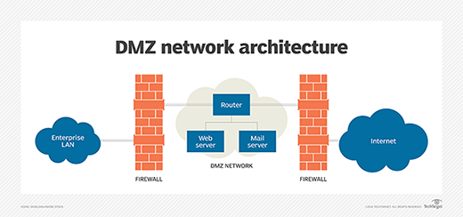

# Exploring Network Technologies and Tools

## Types of Attacks: 
1. Sniffing Attacks : Capture data over the internet and read that data using protocol analyser. 
2. DoS and DDos : Service disruption attacks. 
3. Poisoning Attacks : Try to change cached values with different values.

## Networking Protocols: 

1. **TCP** -> connection oriented traffic with guaranteed delivery. it uses a 3 way handshake to start a session. 
2. **UDP** -> connectionless session without the guarantee of delivery. 
3. **IP** -> Network layer protocol with ensures delivery of TCP/UDP packets to the right host. Uses 32/128 bit IPv4/6 addresses to uniquely identify devices. 
4. **ICMP** -> Network layer protocol which is used to test basic connectivity. 
5. **ARP** -> Resolves IP addresses to MAC addresses i.e physical addresses of the device the message is being sent to. 
6. **NDP** -> IPv6 version of ARP and discovers IPv6 devices on the network.

## Use case wise protocols:

### Voice and Video Use Case:
In case of streaming services its UDP that is used as it ensures once only delivery.   
**RTP(Realtime Transport Protocol)** delivers audio and video over IP. VoIP, streaming, video teleconferencing all use RTP/Secure-RTP. 

### File Transfer Use Case:

Users might want to transfer files over the internet for multiple use cases like Online Cloud Backups. 

**FTP** is the most widely used protocol for the same and uses TCP. It uses port 21 for control signals and 20 for data. FTP passive uses port 21 for control and a random port for data. 

**TFTP** Trivial FTP uses UDP port 69 and is useful for transferring small amounts of data. 
FTP can be secured by using any of TLS, SSL, SSH or IpSec. 

**SFTP** uses SSH for secure FTP. It uses port 22 to transmit data. 

**FTPS** uses TLS to encrypt traffic. It generally uses 989 and 990 but this can be changed to 21 and 20.  

### Email and Web Use Case:

**SMTP(Simple Mail Transfer Protocol)** transfers emails between clients and SMTP servers.  It uses YCP port 25 and unofficially uses 587 for TLS and 465 for SSL. Recommended pracitce is to use STARTTLS for secure communication.  

**POP3(Post Office Protocol)** transfers emails from servers to client. Uses TCP 110.  

**IMAP(Internet Message Access Protocol)** is used to store email on email servers. Uses TCP 143. Gmail uses IMAP4.  

**HTTP/HTTPS** : protocol of the web. uses 80 for insecure and 443 with TLS/SSL. Used by browser.

### Directory Access Use Case:

**Kerberos** is used in Windows and Unix environments and it uses a KDC to issue timestamped tickets. It uses UDP 88.  

**LDAP** is used to communicate with services such as AD. It uses TCP 389. LDAPS uses 636 for using TLS/SSL.

### Remote Access Use Case:

Telnet(23). SSH(22) and Netcat(any) are generally used in remote access. Windows uses RDP(3389 TCP or UDP) for remote GUI access. 

### Time Synchronization Use Case:

In some systems the time needs to be synchronised for proper functioning of the system. For example, Kerberos where the tokens are time based. NTP(Network Time Protocol) is used in such scenarios.

### Network Allocation Use Case:

**IPv4** which is a 32-bit address expressed in dotted decimal format. Limited public IPs available and all of them are exhausted, so IPv6 was created. IPv4 is still very widely used as the infra is available for the same and NAT helps share public IPs. 

**IPv6** has 128-bit addresses expressed in hexadecimal format with 8 groups of 4 hexadecimal numbers. It has local workspace and no private IP space due to the large number of addresses available. *fc00* is the prefix for local addresses.

### Domain Name Resolution Use Case:

**DNS** is used to resolve IP for a given URL. Uses UDP and port 53. 
Types of DNS records:
1. *A* -> host record. Holds hostname along with IP and is used in IP lookup. 
2. *AAAA* -> IPv6 host record.
3. *PTR* -> Pointer record which gives the DNS of a given IP. 
4. *MX* -> Mail Exchanger. Identifies mail server used for email. 
5. *CNAME* -> Allows a single system to have multiple associated IPs. 
6. *SOA* -> Start of Authority record includes information about DNS zone and related settings. 

**DNSSEC** is used to overcome DNS poisoning. Adds a digital signature to each DNS record for validating DNS response. 

**Nslookup** or name server lookup is used to troubleshoot DNS related problems. It can resolve specific hostname or FQDNs(Fully Qualified Domain Names) to IP address. 

## Ports Identification:
There are 65536 ports. 
Port numbers used are assigned by IANA. 
1. 0-1023 : Well Known Ports and generally used for commonly used protocols. 
2. 1024-49151 : Ports are regestered to companies for their services. eg, Apache Tomcat on 8080, MySQL on 3306 etc. 
3. 49152-65535 : Dynamic and private ports which can be used by any application. Sometimes even to launch temporary services. 

Port scanning attacks generally target Well known ports plus a few company allocated ports, for example 3306 which is used by MySQL. 

Ports are used to direct the traffic received to the correct service. For proper communicatoin to take place, a client side port also has to be opened for communication along with the server accepting the traffic. Generally, ports 49152 and above are used on the client side for the server to communicate with the client. 

## Basic Networking Devices
Networking communication is either *unicast* or *broadcast*

### Switches
Switches do not have info regrading MAC addresses when starting, but as communicatoin takes place over the switch, it starts storing and recording all the MAC addresses and then forwards only the required messages. 

Since switches do not send a unicast packet to everyone, they make it difficult for the attacker to snoop traffic and hence are more secure than hubs. 

**Port Security** limits the computers that can connect to physical ports on a switch. MAC filtering is also used to determine which specific device can connect to any given port. 

**Loop Prevention** happens when a device connects to multiple ports of a switch. Leads to network degradation and can also disable the switch. STP(Spanning Tree Protcol) is helpful to prevent loop prevention attacks and is now enabled by default in most switches.

**Flood Attacks** try to overload the switch with multiple MAC Addresses for each port leading to switch functioning as a hub. **Flood Guards** help protect against MAC flood attacks. This limits the number of MAC addressses for each port and if this limit is breached it sends an SNMP error message and blocks the port until the port is unlocked bby the administrator. 

### Routers 

Routers connect multiple network segments together into a single network and route traffic between the segments. This means that the traffic is not broadcasted to the entire network thus making network performance better. 

**Access control lists (ACLs)** are rules implemented on a router (and firewalls) to identify what traffic is allowed and what traffic is denied. Rules within an ACL provide rule-based management for the router and control inbound and outbound traffic.

ACLs provide filtering by IP Addresses and Networks, Ports and Protocols. 

ACLs and Firewalls use **Implicit Deny** , i.e any traffic that is not allowed by a rule in the ACL is blocked. 

**Antispoofing** is used to block spoofing attacks on ACLs. Attackers sometimes replace the source IP with a private IP that might exist inside the network. To prevent such traffic, antispoofing rules should be added to ACL. ACLs should block traffic from external sources having IPs in the private IP space range. 

### Bridge

A bridge is similar to a router but works at the physical layer instead of the network layer. 

### Aggregation Switch

It connects multiple switches together in a network. Aggregate simply means that you are creating something larger from smaller elements.

### Firewalls

A firewall filters incoming and outgoing traffic for a single host or between networks.

**Host based Firewalls** monitors traffic going in and out of a single host, such as a server or a workstation. It monitors traffic passing through the NIC and can prevent intrusions into the computer via the NIC. Many OSes have a default Firewall for example, Windows Defender Firewall. 

An *application-based firewall* is typically software running on a system. For example, host- based firewalls are commonly application-based.  
A *network-based firewall* is usually a dedicated system with additional software installed to monitor, filter, and log traffic. For example, Cisco makes a variety of different network-based firewalls. Many of them are dedicated servers with proprietary firewall software installed. A network-based firewall would have two or more network interface cards (NICs) and all traffic passes through the firewall. 

**Stateless Firewalls** are rules implemented as ACLs to identify and block traffic. Rules consist of permission(ALLOW/DENY), protocol, source, destination and port. Sometimes, source and destination might require a subnet to support blocking an entire network. 

**Stateful Firewalls** block traffic based on context, state and rules for the traffic. It keeps track of established sessions and inspects traffic based on states. 

**Web Application Firewall(WAF)** are specially designed to protect web applications.

## Implementing a Secure Network

### Zones and Topologies

Networks are divided into *intranet* which hosts internal-only networks and *extranet* which hosts networks which can be accessed from everywhere. 

**DMZ** helps in this separation. It is a buffered zone between a private network and the Internet. The DMZ zone separates the internet facing devices from the internal only network.

**NAT and PAT** : *Network Address Translation(NAT)* is the reason why we are not using IPv6 already. It provides service providers a way in which they need not provide a public IP to each client they have and instead just maintain a few public IPs. NAT also provides an added layer of security as it protects all the servers/computers inside the network. NAT may have a single public IP and may map all the IPs inside the network to the single IP or it can be dynamic, having multiple public IP addresses and perform load balancing on which IP to send the request from.

### Network Separation
Segregation provides basic separation, segmentation refers to putting traffic on different segments, and isolation indicates the systems are completely separate.

**Physical Isolation** ensure that a network is not connected to any other network. **Airgaps** means that the a system which is airgapped is not connected to any other system. Different color cables might be used to identify such networks in data centers. 

**Logical Isolation** uses routers, firewalls and ACLs to control what and how the traffic is to be routed in smaller networks. *VLANs* can also help serve the purpose of logical isolation. 

*Layer 3 switches* which work at the network layer instead of physical layer can help in implementation of Virtual LANs and help better division of network. This switches are a hybrid of routers and layer 2 switches, and as a result help protect against ARP based attacks. 

With VLANs several different systems can be grouped logically, for example, developer group, business group etc which can help divide traffic and give permissions accordingly. 

**Meddia Gateways** are used to convert traffic from one format used on one network to the format in another. For example, VoIP gateway convert VoIP to traditional phone line. 

**Proxy Servers** are used to make request to a server in place of a given device. These can be used to improve performance by caching or restict content. 

A **Reverse Proxy** might be used on the server side, to protect the web server and put it in a private network. The proxy server acts as a web server protecting the actual web server from all types of attacks. 

**Unified Threat Management** is a single solution to multiple security controls. UTM security appliances combine the features of multiple security solutions into a single appliance. For example, a UTM security appliance might include a firewall, antivirus protection, anti-spam protection, URL filtering, DDoS mitigator and content filtering.

**Mail Gateways** examines all incoming and outgoing email and attempts to reduce risks associated with email. Many times its present in UTM appliances. Mail gateways often include data loss prevention (DLP) capabilities. They examine outgoing email looking for confidential or sensitive information and block them.
